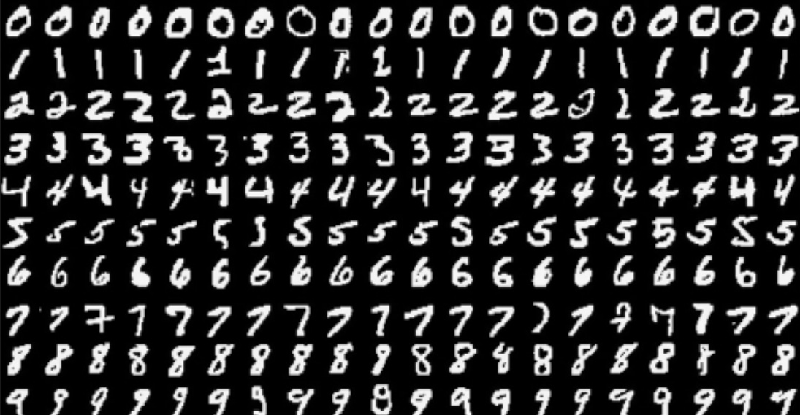
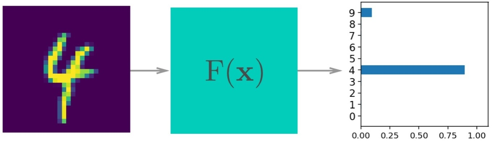
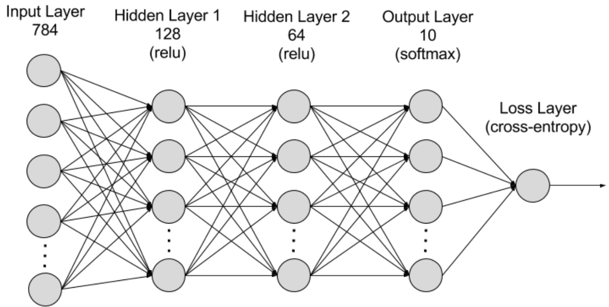

# Lab 1

This lab will use the UVA Rivanna to benchmark a simple CNN with TensorFlow2 using the MNIST dataset. This instruction will show using Rivanna OnDemand. But you can use slurm too if preferred. The lab will have the following steps:

## Environment

You'll need a python >= 3.9 environment with the following libraries

* Tensorflow
* Matplotlib
* Numpy

Getting the environment includes

1. Open [Rivanna Ondemand](https://ood.hpc.virginia.edu/pun/sys/dashboard)
2. Goto `Interactive Apps -> JupyterLab`
3. Launch a GPU session. The following shows a session opened in the scratch directory using V100 GPU and 16GB memory for 1h. 
  

4. Connect the session and open a terminal. Clone the course [git repository](https://github.com/UVA-MLSys/DS7406-Spring-2025). And open the [MNIST_Tensorflow](./MNIST_TensorFlow.ipynb) notebook. For kernel, you can choose the existing Tensorflow 2.17 kernel from the top right corner of the notebook in Rivanna session editor.

## Model Training & Evaluation

1. This lab will train a simple CNN with TensorFlow2 using the MNIST dataset. which contains greyscale handwritten digits. Each image is 28x28 pixels, you can see a sample below: 
  

2. Our goal is to build a CNN that can take one of these images and predict the digit in the image. 
  

3. Here is how the structure for our CNN model looks like 
  

4. The [MNIST_Tensorflow](./MNIST_TensorFlow.ipynb) notebook already contains all implementations. Your task will be to made necessary modifications to recornd the benchmarks for submission.

## Submission

1. Record the train, validation and test loss for each training epoch [10, 20, 30, 40, 50].
2. Plot the train, validation loss history for 50 epochs.
3. Plot the train, validation and test loss and accuracy for those different epochs [10, 20, 30, 40, 50].
4. Write a 1-2 page report on your insights and with these two plots. Submit that report file and your code/notebook.
